#  HOSTING A STATIC SITE ON AWS USING S3 BUCKET.

## Steps   

#### 1. Login to your AWS account (preferably as an IAM user, which is a best practice)   

#### 2. Navigate to services, search for S3 (this means simple storage service) and click on S3, create bucket to create a bucket; fill up the needed information in the general configuration, such as bucket name, AWS, region, encryption key type etc.    

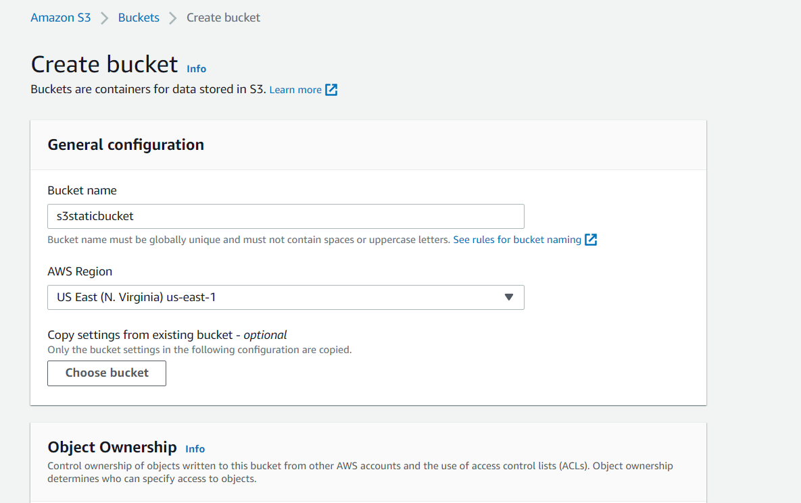   

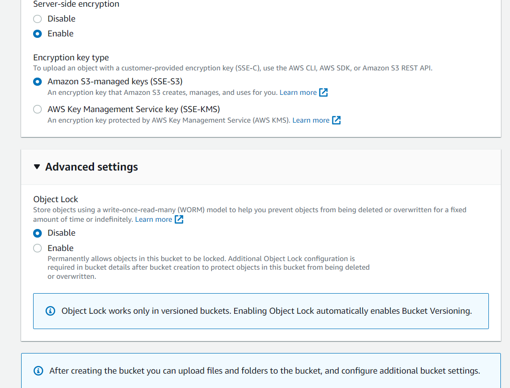  

#### 3. After bucket has been created, the user is alerted via the confirmation message highlighted in green, a created bucket shows: bucket name (which is always unique, AWS region, access level, and creation date).  
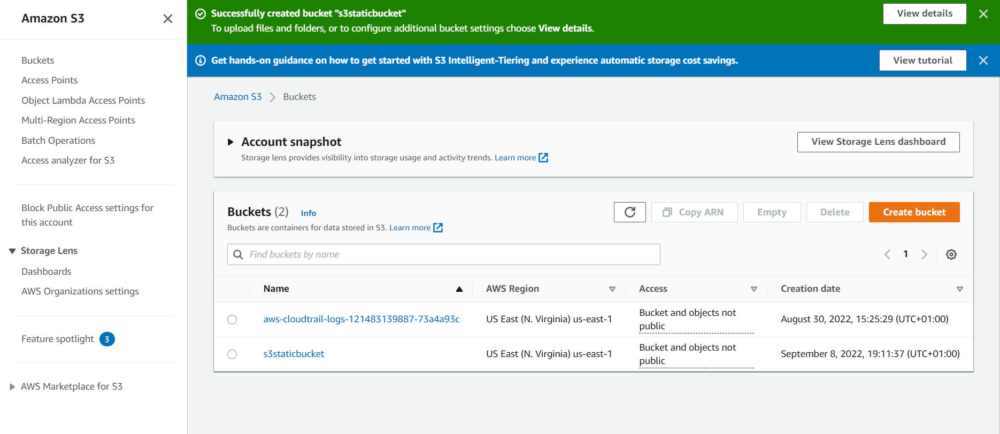  

#### 4. To host a static website, a bucket has to be created in other to store our source code and other static files by uploading these files to the recently created bucket, this is done by clicking on the newly created bucket and clicking on upload button, files can be uploaded via drag and drop method or manually adding files or folders ( as the case may be).  
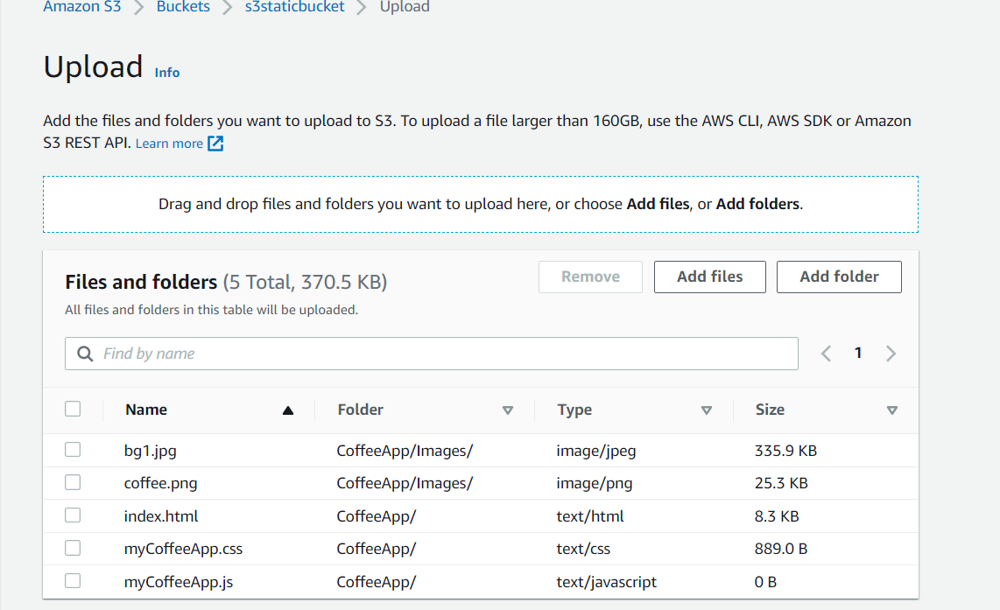  

#### 5. Note the destination section (bucket versioning which allows to restore previous version is enabled), click the upload button.  
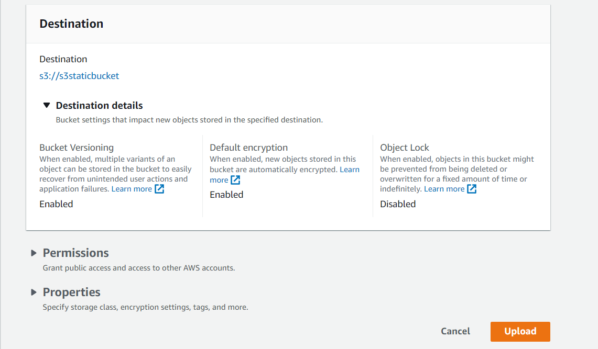  

#### 6. The files were uploaded successfully, note the green highlighted confirmation message, and the status of the uploaded files (succeeded).  
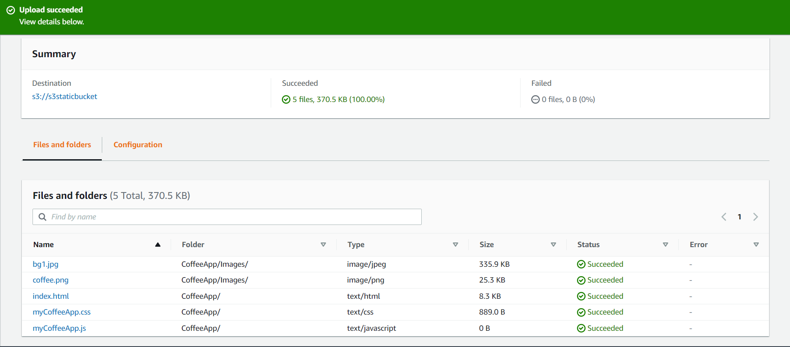  

#### 7. For our static site to be visible, static website hosting has to be enabled, in hosting type, host a static website should be checked; also the name of the home page should be included and error page (if any), block all public access should also be unchecked to make our site publicly accessible.  
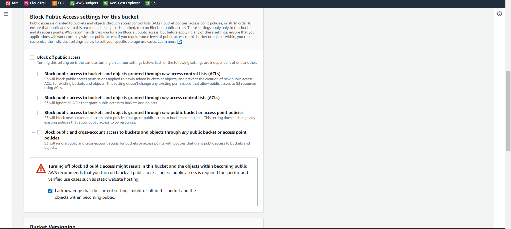  
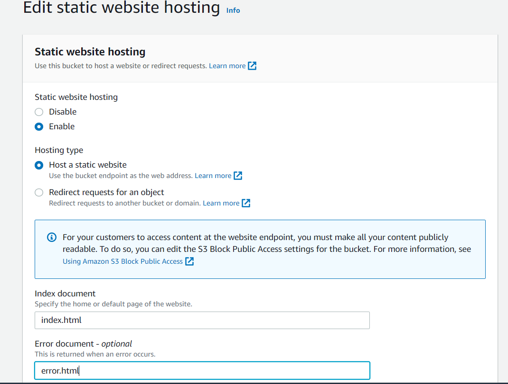  

#### 8. Edit Bucket policy, bucket policy provides access to objects stored in the bucket, this is usually written is JSON; for this project it is essential to explicitly allow and ensure the resource is having the name of the particular bucket the static files are stored in (this can be copied from the top, the bucket ARN.)  
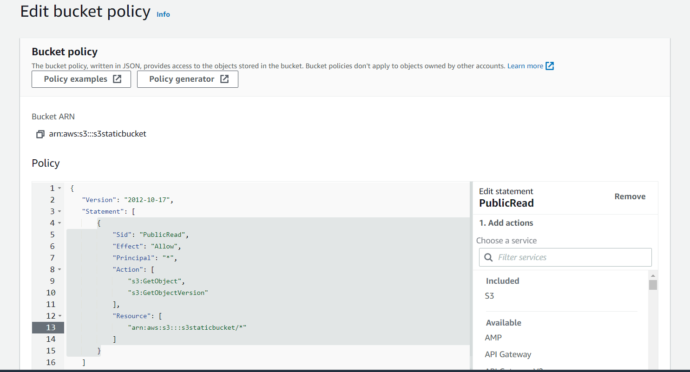  
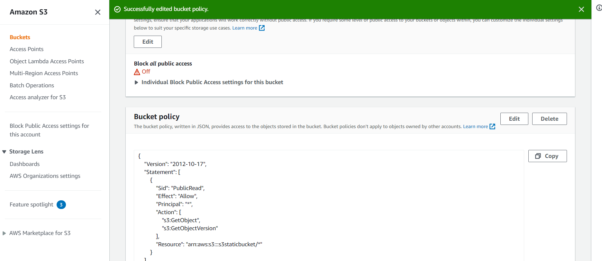  

#### 9. Bucket policy has been successfully edited, and block all public access has been turned off.
#### Note that bucket policy resource has the name of the bucket I am currently working with.  

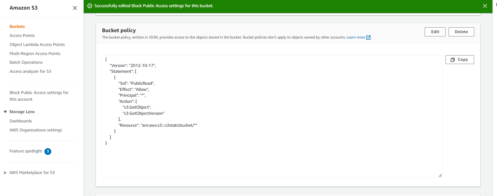  

#### 10. Copy URL and paste on the browser, and the static site (well configured and made publicly accessible) will be visible on the browser.  
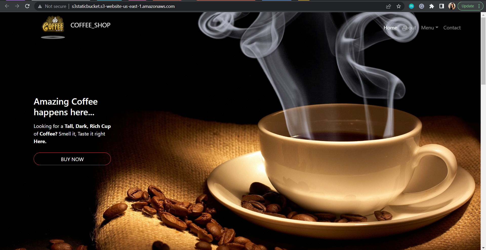  

#### RECOMMENDATIONS

- It is recommended to do this project on an IAM user's account (by default, an IAM user has no permission, it is advisablw to give the IAM user permission to perform this function).
- Bucket names are unique, that is one bucket name cannot be used more than once, aways give your bucket realistic names.
- Always enable static hosting and uncheck block public access settings for the bucket housing static files to make these files publicly accessible.
- Ensure that the bucket policy has the name of the bucket housing the static files, also ensure that each opening bracket or curly brace has a corresponding closing brace / curly bracket.