# CREATING USER AND GROUP, ASSIGNING USER TO A GROUP, AND ASSIGNING ROLE TO A GROUP.

### __USING AZURE PORTAL.__

#### Steps.

##### 1. Login to your azure account.
##### 2. On resources or on the search bar, search for __azure active directory__.
##### 3. Click on AAD and navigate to add icon to create user and fill up the fields, taking note of username and password (this should be saved in a safe place).   
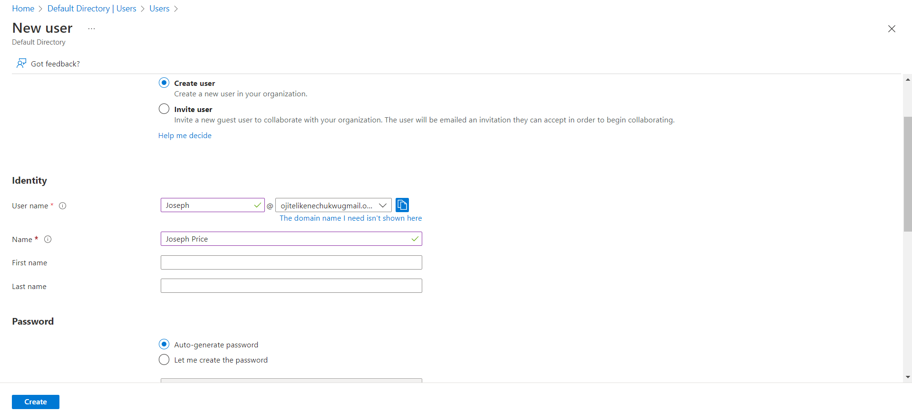
##### 4. Click the create button to create user, take note of already created users.  
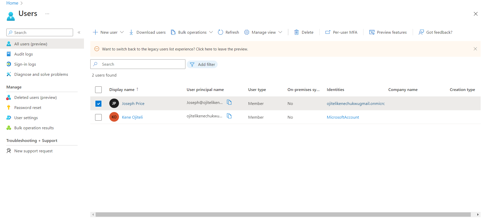

##### 5.Create a group by choosing the group option from the add icon, add a member to the group from the right hand side.  
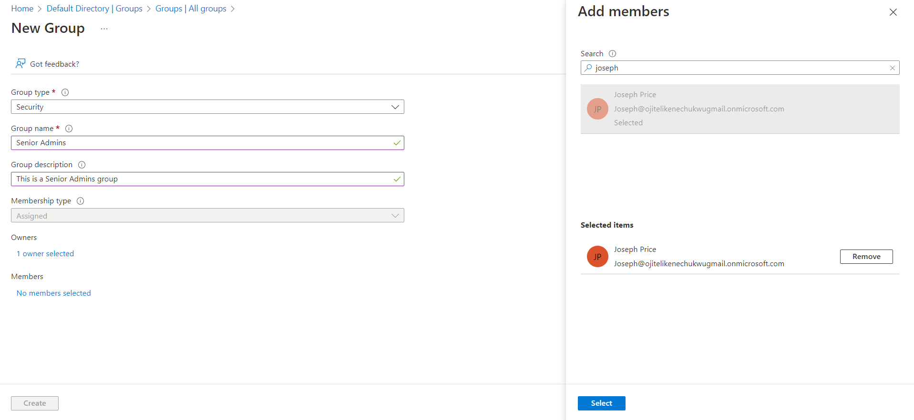

##### 6. Notice the just created group that has one member (user).  
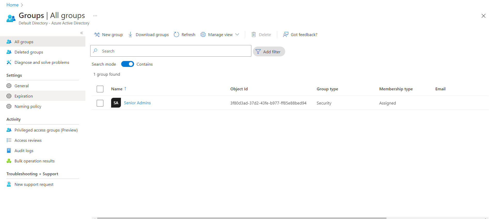

### __USING AZURE POWERSHELL__

#### Steps.

##### 1. Open the Cloud Shell by clicking the first icon in the top right of the Azure Portal. If prompted, select PowerShell and Create storage.  
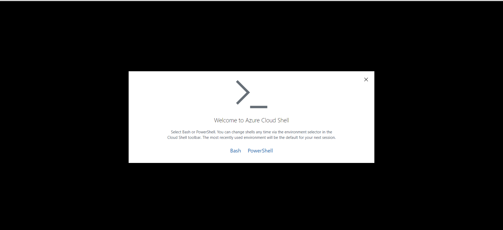   
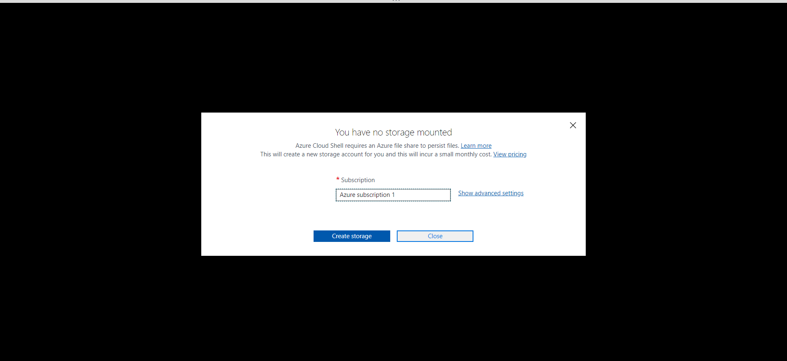

##### 2. The commands will  aid in creating a user and group and assigning user to a group:
  - ##### Create a password profile object.
  - ##### Set the value of the password within the profile object.
  - ##### Connect to Azure Active Directory.
  - ##### Identify the name of your Azure AD tenant. 
  - ##### Create a user account for Isabel Garcia.
  - ##### List Azure AD users.
   - ##### create a new security group named Junior Admins.
  - ##### List the groups in your Azure AD tenant (the list should include the Senior Admins and Junior Admins groups).
  - ##### Obtain a reference to the user account of Isabel Garcia.
  - ##### Add the user account of Isabel to the Junior Admins group.
  - ##### Verify that the Junior Admins group contains the user account of Isabel.  
  
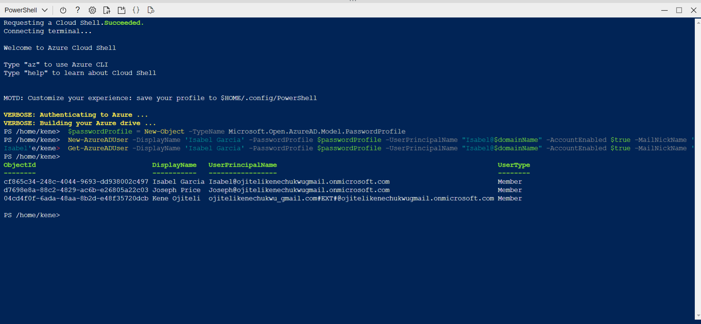   
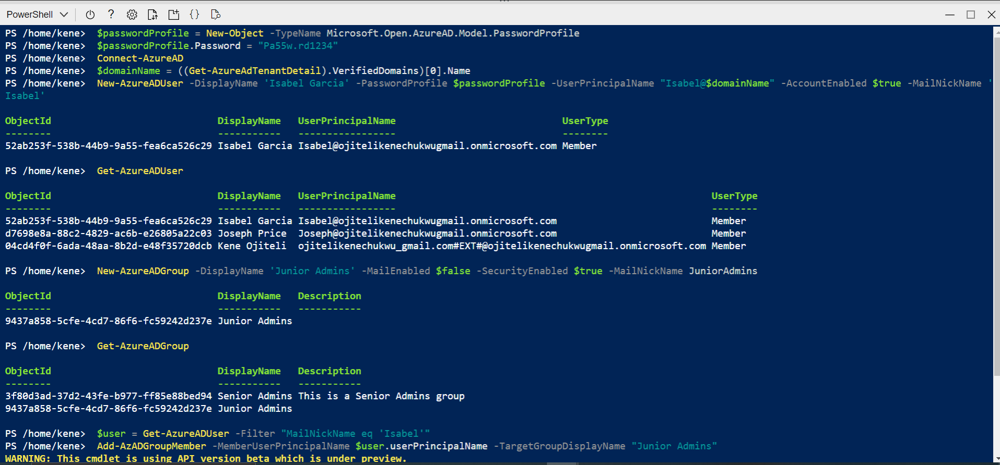

### __USING AZURE CLI__

#### Steps.

##### 1. On the cloudshell plane, I use Bash instead of powershell.
##### 2. The commands create a user and group and assigns user to group created.  
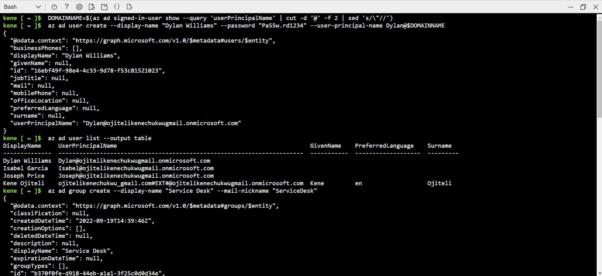   
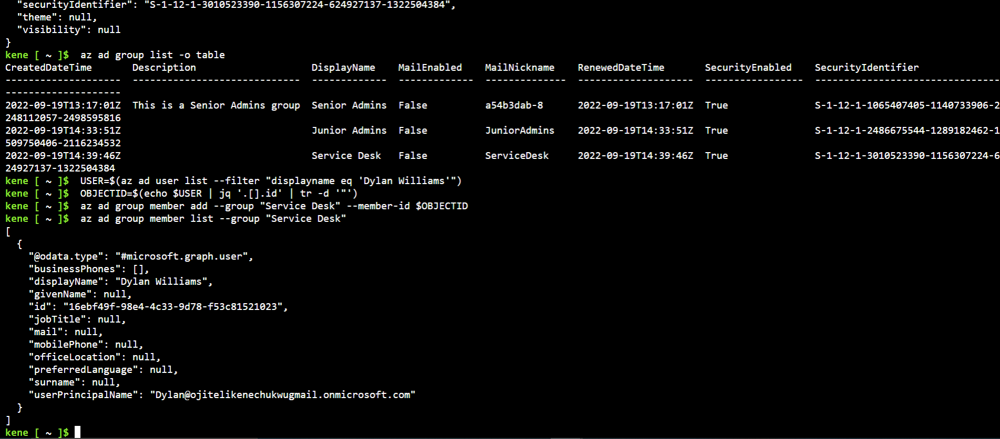

### __ASSIGNING A ROLE TO A GROUP__

#### Steps.

##### 1. In the Azure portal, in the Search resources, services, and docs text box at the top of the Azure portal page, search for Resource groups, click the create to create a resource group.   
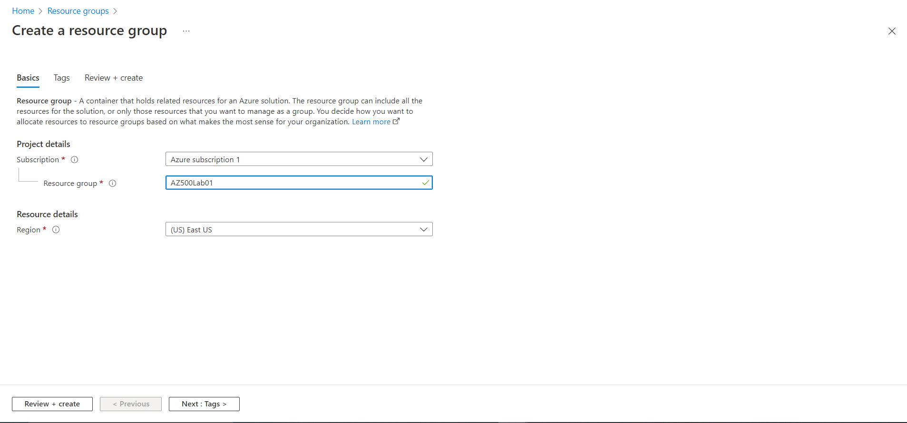

##### 2. Notice the newly created resource group.  
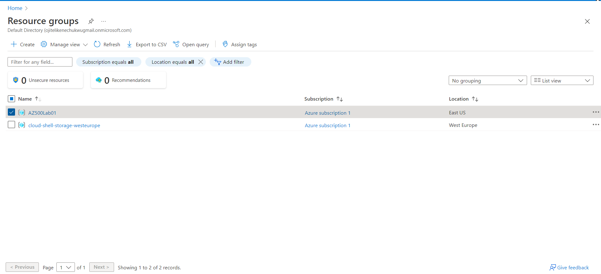

##### 3. On the newly created resource group, click Access control (IAM), then __Add__ and select __Add role assignment__ on the dropdown (select a role assignment, virtual machine contributor in this case).  
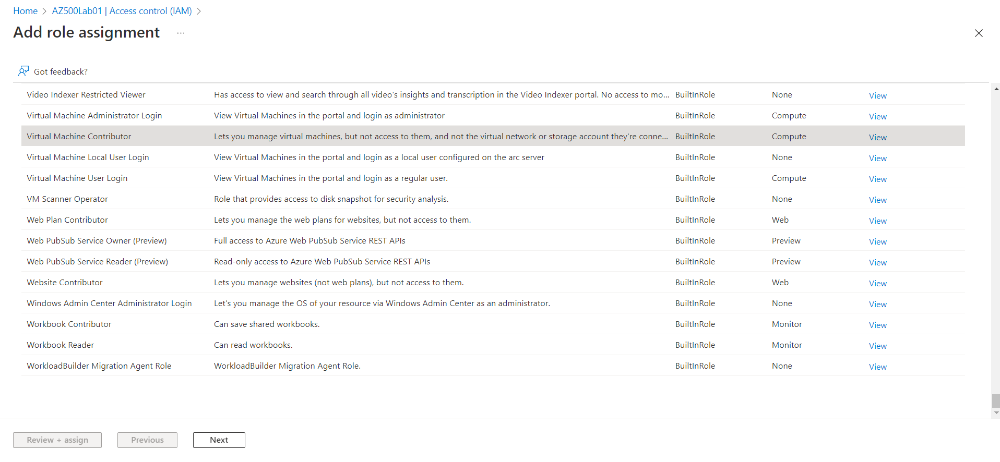

##### 4. Review selected role, assign access to, then add member(s), then review and assign.  
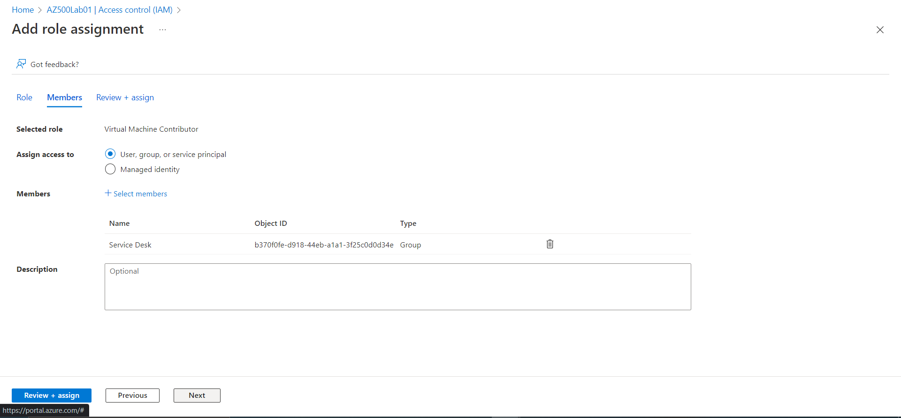
##### 5. Search for the user(s) you added, check their role assignments and notice they have access to the role (virtual machine contributor)  
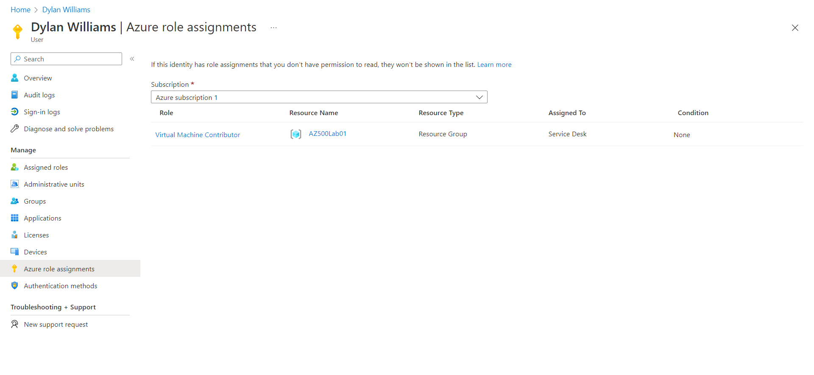   
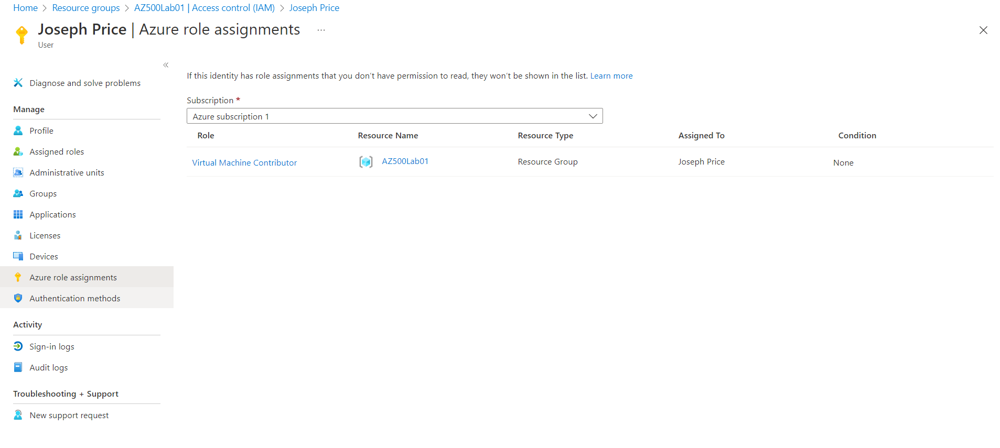

### __CLEANING UP RESOURCES__
##### It is recommended to remove any newly created azure resources no longer in use so as not to incur unexpected costs, this was done using the command in the picture below.  
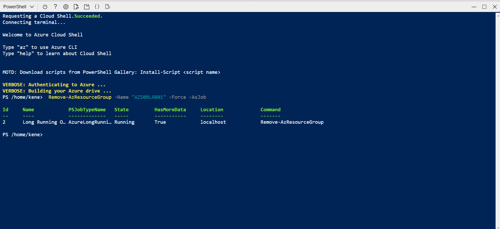

