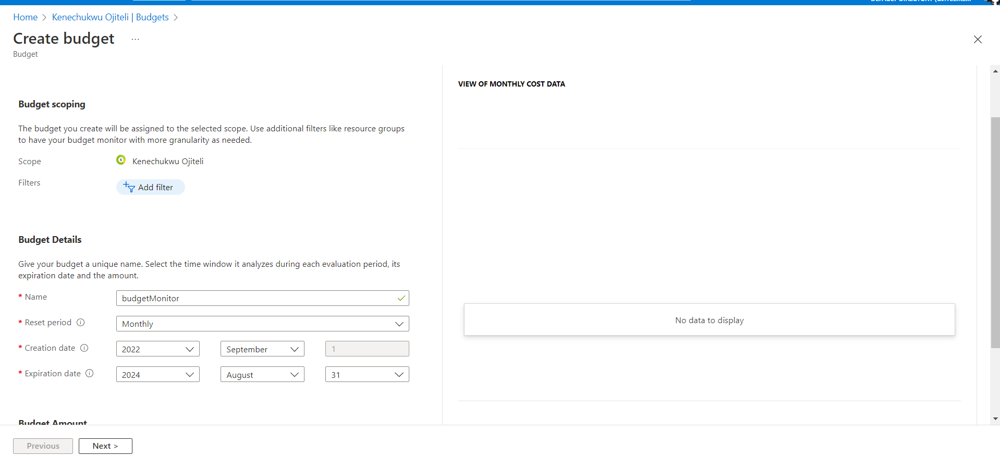
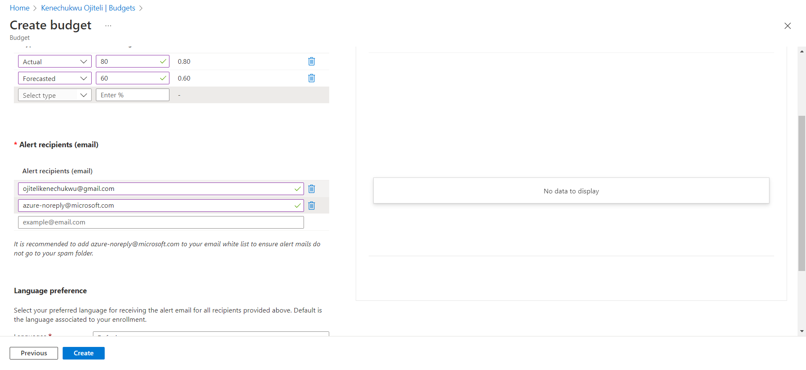
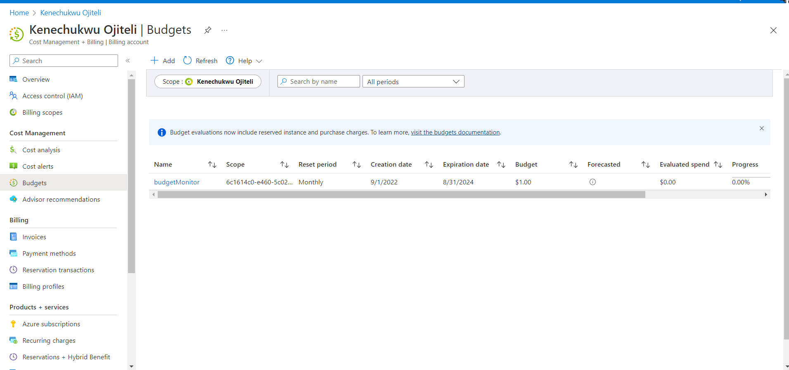

# Creating Budget On Azure Account

## Steps    

####  1. Login into Azure Account.     

####  2. On Azure services, navigate to Cost management then budgets.     

#### 3. Create a budget using the add icon, remember that budget names are unique, put your budget amount.     

     

#### 4. Set alerts for your forecasted and actual budgets with a preferred email address.     

      

#### 5. Press the create button to create budget.     

     

#### Cost Management help you plan for and control your costs by creating budgets to avoid incurring unexpected costs.