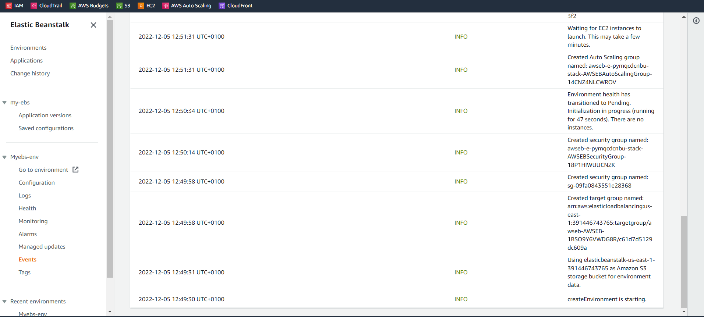

#   HOW TO DEPLOY A SAMPLE APP ON AWS USING ELASTIC BEANSTALK (EBS)

#### __Service(s) required__
#### - Elastic beanstalk - that automatically creates an s3 bucket, a target group in the default vpc, multiple security groups, multiple EC2 instances and cloudwatch alarms, an autoscaling launch configuration and an autoscaling group, EC2 load balancer

#### __Steps__

#### 1. Login to your AWS account
#### 2. Using the searchbar, search for __elastic beanstalk__

#### 3. Create application using create application wizard

#### 4. Naming my application and giving it a tag

#### 5. Tomcat (tomcat webserver) is our platform choice with its recommended version, I will be using a sample application so I do not need to upload any code

#### 6. EBS is creating an environment for my sample application to run (this may take a while)  

#### __An environment is the collection of AWS resources and permissions to allow your web application to run smoothly. EBS manages the environment for us__  

#### 7. The green checkmark shows my application has been created, with an Ok health status

#### 8. Notice the logs of each event (success and failure) after the creation of the environment
  

#### 9. Copying the URL from above my apllication's name and pasting on a web browser shows the sample app I just deployed

#### 10. I cleaned up by deleting the resources created by my EBS including the elastic beanstalk itself(which automatically deletes the environment) to avoid unnecessary charges
  
  
