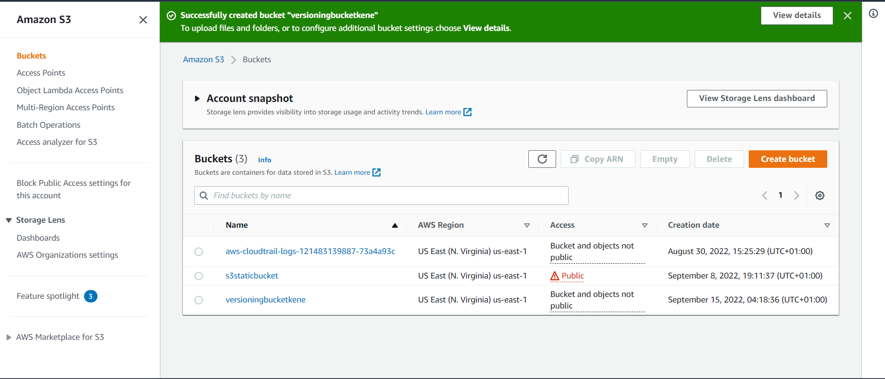
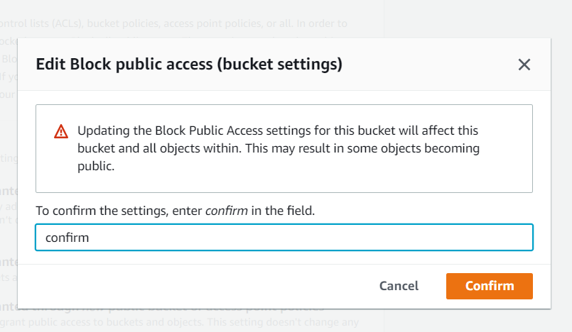
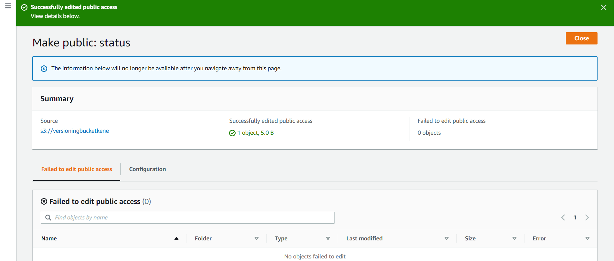
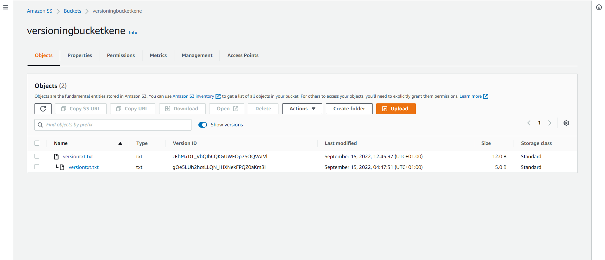

# HOW TO ENABLE VERSIONING IN AWS

#####  __Bucket Versioning__ on __Amazon S3__ is recommended to help protect against unintentionally overwriting or accidental deletion of objects; This service ensures that if someone accidentally performs a delete request on an object, it will not be deleted. Instead, a delete marker will be added. You can then delete this marker to recover the object. You should also consider setting a bucket policy so that not all users can perform delete requests.   

##### Steps.

##### 1. Login to your AWS account.
##### 2. Navigate to S3 and create a bucket (mine is named __versioningbucketkene__, as bucket names should be unique), enable __bucket versioning__.

##### 2. Upload a file (object) in bucket.

##### 3. To make my text file visible, I have to uncheck block public access (note that this is not best practice, just for learning purposes, as I can download and view the file).

##### 4. Confirming that I am unchecking public access.
  

##### 5. Object is made public so as to be viewable on the browser (just for learning purposes).  
   

##### 6. I modified the file and re-uploaded, toggle the __show versions__ switch, notice that I have 2 text files of different sizes (these are the multiple versions of the file). If the toggle switch is off, only the latest version is visible.

##### 7. To view any file, i have to make it public.

##### 8. Say, I delete a file by mistake (by clicking the delete button and typing delete for confirmation) .

##### 9. Notice there are no files.

##### 10. To view files toggle the show versions switch; Notice the __delete marker__ (to recover the file, delete the delete marker).

##### 11. Type __permanently delete__ to confirm deletion.

##### 12. After deletion of delete marker, the latest version of the file is visible.

##### 13. To view all versions, simply turn on the show versions switch.

##### 14. Files can also be permanently deleted by clicking delete and typing permanently delete to confirm deletion.

##### __Note that Cost will be higher with versioning turned on because there will be several versions of an object (file).__
