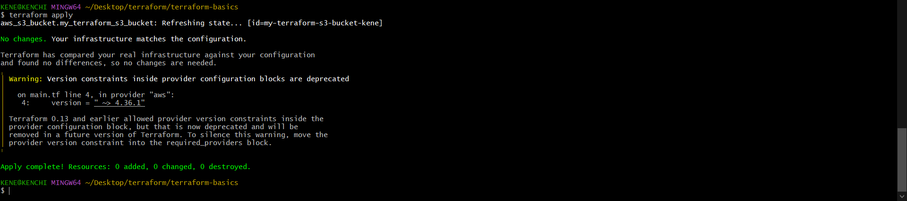
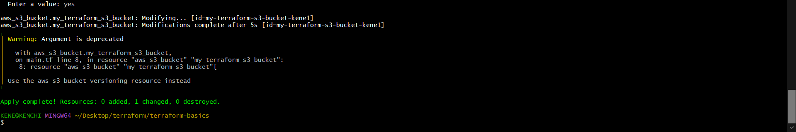

# LEARNING THE BASICS OF TERRAFORM BY CREATING S3 BUCKET AND IAM USERS

#### Terraform is an infrastructure as code tool which is used to create resources.

#### __Requirements__
  * #### AWS account
  * #### Terraform
  * #### Visual studio code
  * #### All my commands were run on __git bash__

#### Terraform is downloaded as a binary package specific to your operating system, to install save in a preferred folder then copy file path to environment variable (this can be confusing at first).

#### Run __terraform version__ to see if terraform is properly installed (it should bring up a version).

#### Steps

#### 1. On vs code, configure provider (AWS in this case), in __main.tf__ file

#### 2. Run __terraform init__ to initialize and install plugins required; after include provider region and version in main.tf file.

#### 3. Login to your AWS account to create an IAM user, using programmatic access as access type.

#### 4. Create an S3 bucket on AWS, giving bucket a unique name.

#### 5. Before creating resources, we have to authenticate terraform to AWS provider, using the environment variables method (which involves exporting the access keys created from the IAM user given the programmatic access type), this method is safer and preferable.

#### Create resource using this format resource "aws_s3_bucket""my_terraform_bucket"{
 #### bucket = "bucket_kene"

#### }

#### 6. Run __terraform plan__ command to create an execution plan, it gives details of what terraform will do when a command is executed.
   

#### 7. Run __terraform apply__ command to execute the action stated in the  plan, it also generates the plan and asks if we want to perform the actions (it performs the action if we specify, yes).

  

#### 8. Notice the bucket specified earlier has been created on AWS, 

#### 9. Using the terraform apply command, terraform recognized that no change has been made after refreshing state.

#### 10. After apply command, it creates a __terraform.tfstate__, which contains details in JSON format

#### __Terraform has what is called states namely: desired state, known state and actual state__.
#### Desired state - is the actual state we want to create using terraform.
#### Known state -is stored in the terraform.tfstate, it is the state of the previous execution, which acts as a backup.
#### Actual state- this is the state in the cloud

#### 11. To see how states work in terraform, I edit my bucket name (which is my desired state) and run terraform apply again, notice that it refreshes the state using the id gotten from the known state (previous execution), then recognizing that it is not the same with known state, it replaces the old bucket name in the actual state with the new bucket name  

#### 12. It shows that one resource is destroyed(old bucket name) and one is added(new bucket name).

#### 13. Notice that he name has been edited on AWS (which is our actual state)

#### 14. On main.tf, I updated the version from false to true and ran terraform apply, using the concept of state, terraform was able to recognize the change before updating.

#### 15. Using __terraform console__ command, we can view output on the console (you can leave the console using __exit__)

#### 16. Or viewed by declaring output on __main.tf file__

#### 17. Create 2 IAM users by declearing on the main.tf file
   

#### 18. IAM user created on terraform, visible on AWS

#### 19. __terraform destroy__ command destroys all the resources being managed by the current working directory, it deletes the resources from AWS.
  

#### 20. This is the whole code to create IAm users and S3 buckets, they can be split into different files for clarity (eg. the resource bit in one file and the output bit in a seperate file).

#### __Note that if you have issues creating your resources on terraform, check that your resource name is unique (example bucket name) and you are using the correct access keys__.

