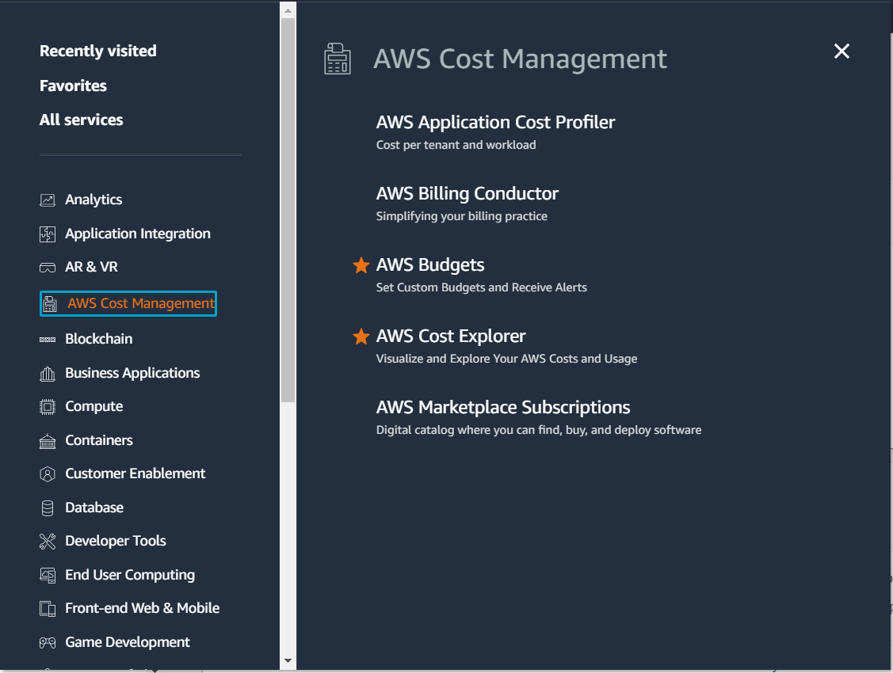
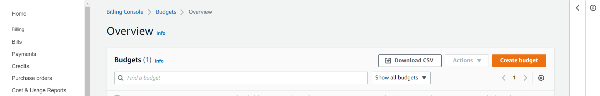
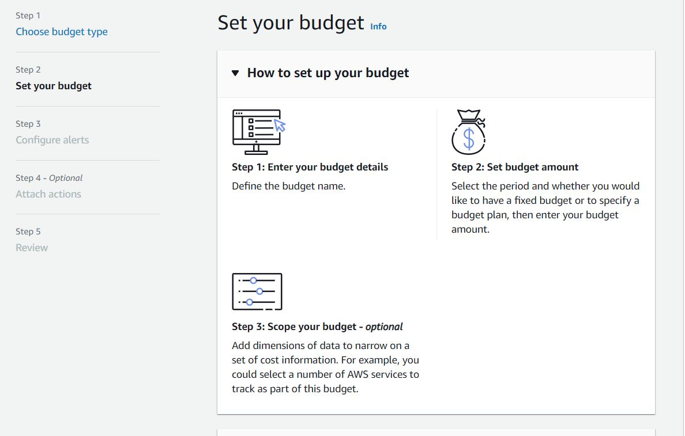
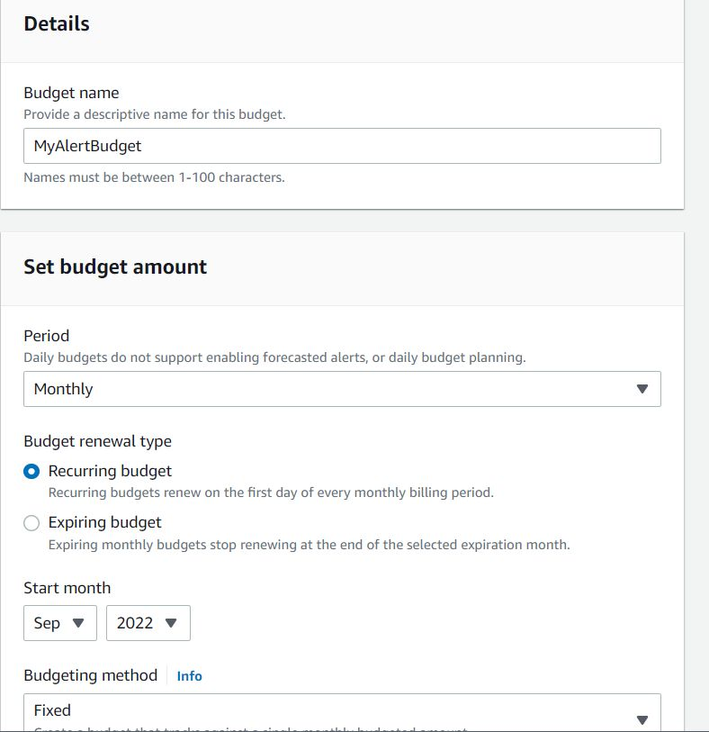
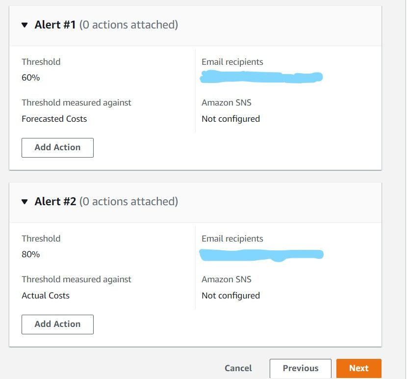
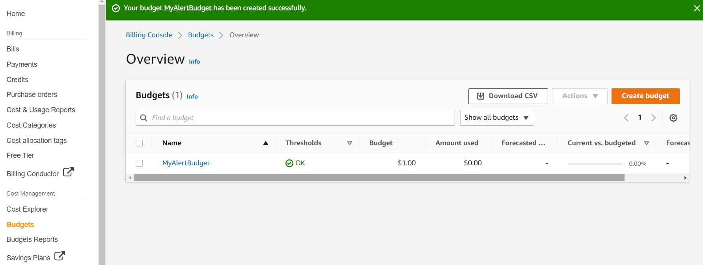

# SETTING BUDGET ON AWS.
### Steps.
##### 1. Login to your AWS account preferably as an IAM user (best practice).
##### 2. On services, click __AWS cost management__ and navigate to __AWS budget__.  

##### 3. Click the create bucket button, to choose a budget type.  

##### 4. I am creating a cost budget which is also recommended ( to avoid unexpected charges).  

##### 5. Enter budget details, such as budget name, period, budget renewal type, start time (month).  
  
##### 6. Set alert for threshold (both actual and forecasted budget) to a preferred email address.  
  
##### 7. Budget has been successfully created.   
  
##### 8. Alternatively, budget can be created via the username dropdown, __billing dashboard__ link.   
##### Budgets are set to alert the user when you exceed your budgeted thresholds and also to track and take action on your costs and usage.